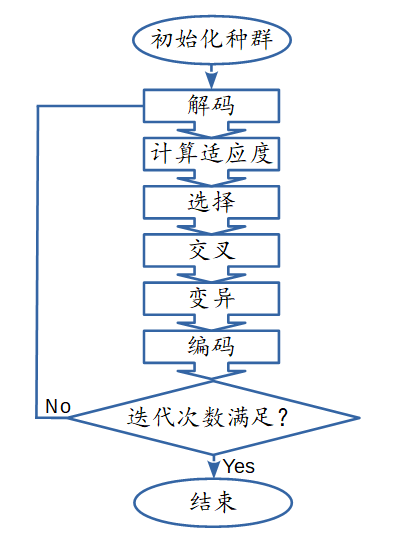

# Genetic Algorithm

遗传算法属于进化算法，进化算法又是优化算法的一种。优化算法还包括各种梯度下降算法。总之这类算法是用来解决最优化问题的，尤其是算法复杂度为n!的NP问题。因为计算机的能力有限，但是解空间又异常的巨大，导致单纯的用枚举算法去解决问题效率会异常的低下(虽然能保证最优解)。例如旅行商问题(给定N个地点的坐标信息，设计出一条路线使得不重复遍历每个地点最终总路程最短。这个问题的解空间大小就是N!)，枚举计算时间长度会随N的增加而指数型增加。还有高维函数的最优解问题，若是一元函数切定义域为[0,1]，若要求解的精度为0.001，那么解空间的大小就为1000，此时只需要计算一个点就可以得到问题的答案，但是若是n元函数的高维问题，解空间的大小则就会变为1000^n(这里假设每个变量的定义域和所需精度相同)。实际上有很多问题当变量变多的时候就会导致指数灾难。那么此时优化算法就派上用场了，这里我仅谈进化算法，梯度下降算法的机理和进化算法的不太一样。

常见的求最优解问题的进化算法有遗传算法，模拟退火算法，粒子群算法和蚁群算法等。之所以叫进化算法，是由于这类算法中每次迭代后的结果和上一次的结果是有关联的，而且会随着时间发生变化。其中遗传算法的解空间为一种称之为染色体(Chrom)的集合，每个染色体对应于实际求解问题解空间中的一个解(其中染色体变换到解的过程称之为解码过程decode，该过程的逆过程称之为编码过程encode)，染色体变量本身的形式为一个列表(这个列表的元素称之为基因Gene)，分问题不同可以是普通数字，也可以是二进制代码(为了扩大变量的随机性，往往效果更好，但是难于理解)。另外还需要一个适应度函数用来判断当前解(染色体)的好坏，例如旅行商问题中的适应度函数就是总距离。这些算法又可以称之为仿生算法，算法的实现过程就是模拟一种真正存在的现象，例如遗传算法就是模拟染色体优胜劣汰遗传的过程，蚁群算法模拟的是蚂蚁寻觅食物的过程。从而算法中对染色体操作的几个过程的名字也比较有意思，分别为选择(Selection)，交叉(Crossover)和变异(Mutation)。整个算法最初是利用随机数均匀初始化一个给定个数的染色体数目(这个染色体的集合我们称之为种群Population)，染色体较为均匀的分布在整个解空间中，具体要撒多少个点，视具体问题而定。然后利用适应度函数计算出每个染色体的适应度。首先进行的就是选择操作，先将染色体由好到坏进行排序(最值问题就是从大到小或者从小到大)，然后挑选出一定比例最优的染色体，这个比例称之为存活率。接下来就是交叉操作，利用挑选出来的染色体两两相互进行随机交叉产生下一代染色体。交叉操作也有很多种，一般的就是随机互换两个染色体中某一个基因。最后一个步骤就是变异操作。和交叉操作一样这里要根据具体问题来确定具体变异方式，对于最值问题而言就是对于每个染色体，有一定概率这个染色体上的基因会发生变化，这个概率我们称之为变异率。变异率一般很小。这里就完成了一次迭代的操作，迭代的终止条件一般就是认为给规定的迭代次数。

更为详细的内容可参考https://www.zhihu.com/question/23293449
我的例子是求解f(x) = x+10*sin(5*x)+7*cos(4*x)最优解。具体代码请点击阅读原文。
例子来源于https://www.zhihu.com/question/23293449/answer/120220974
网友利用不同语言进行了解答，这里算是我补充了一个Fortran版本的方法。

代码:
[Python](./TSP.py)， [Fortran](./main.f95), [Fortran-v2](./version2.f90)
