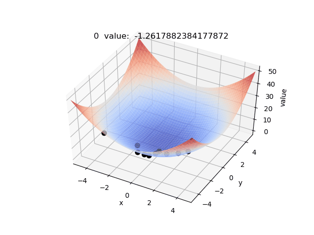

# Particle Swarm Optimization

粒子群算法也是一种仿生算法，它模拟的是鸟类觅食过程，和遗传算法一样，刚开始也需要初始化一个种群(模拟鸟群)，每个粒子携带着位置信息和当前的运动速度。在每一步迭代中需要更新所有粒子的速度信息和位置信息(当前最好的位置)。

每个粒子的位置对应于求解问题中的自变量，判断当前位置好不好的标准和遗传算法一样，是通过适应度函数得到的(比如说对于求解最大值的问题，值越大越好)。在求解高维函数的最值问题当中，每个粒子的位置信息就是该高维函数的一组自变量值。

这个算法的核心在于速度更新公式。
若我们假设粒子i的位置和速度可以用一个一维向量表示

每个粒子到当前最优位置为

全局最优位置为

速度更新公式中有三个常数，一个权重的常数

和两个学习因子

。

其中ran()是0到1之间的随机数。

位置更新公式为

这里需要注意的问题是速度更新和位置更新都是有限制的，其中位置更新要满足变量在定义域内，而速度更新一般会给一个上限，不然会使得粒子的位置跑出定义域。
另外速度更新公式中的c1+c2一般是等于4的，w的值一般取0.5-1之间，不同问题可以多试几组。

总结一下就是：
> 1. 初始化粒子位置和速度(0)
> 2. 计算当前全局最优位置和每个粒子的当前最优位置
> 3. 利用速度公式进行迭代计算下一次的速度和位置，其中要考虑上下限问题
> 4. 判断迭代条件是否满足(一般而言是通过设置一个确定的迭代次数)，满足则退出，否则回到步骤2.

以下是我求解一个抛物面函数的动态过程，其中黑色的点是粒子，能看到所有粒子慢慢的都趋向于最值处。另外粒子群算法效率一般比遗传算法高，但是容易收敛到极值点而不是最值点。

代码:
[Python](./main.py)
