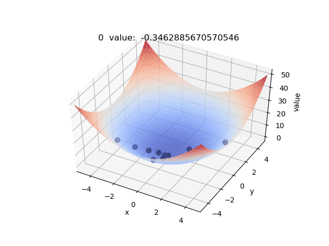

# Particle Swarm Optimization

粒子群算法也是一种仿生算法，它模拟的是鸟类觅食过程，和遗传算法一样，刚开始也需要初始化一个种群(模拟鸟群)，每个粒子携带着位置信息和当前的运动速度。在每一步迭代中需要更新所有粒子的速度信息和位置信息(当前最好的位置)。

每个粒子的位置对应于求解问题中的自变量，判断当前位置好不好的标准和遗传算法一样，是通过适应度函数得到的(比如说对于求解最大值的问题，值越大越好)。在求解高维函数的最值问题当中，每个粒子的位置信息就是该高维函数的一组自变量值。

这个算法的核心在于速度更新公式，一般的我们设$x_v$

代码:
[Python](./main.py)
